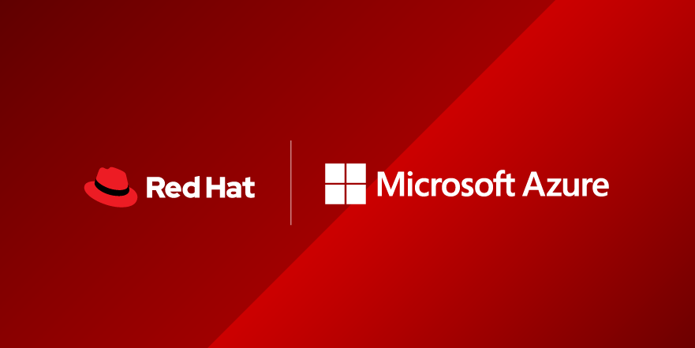

# Deploy and scale Microsoft Azure Cloud Native infrastructures and applications with Red Hat Ansible Automation

<b>This repository contains practical exercises for the Red Hat Summit 2020 Instructor-Led-Lab (ILL), Deploy and scale Cloud Native Microsoft Azure infrastructures and applications with Red Hat Ansible Automation.</b>

<h3>Utilizing the Azure Linux CLI, these labs will allow you to interact with Azure to perform the following tasks using Ansible by Red Hat:</h3>

<b>Deploy an application and leverage Cloud Native services to scale:</b>

<li> Working with the Azure Linux CLI
<li> Connecting Ansible to Microsoft Azure
<li> Create a Red Hat Enterprise Linux virtual machine in Azure using the Azure Marketplace.
<li> Create and configure an Azure MySQL PaaS database.
<li> Deploy an application on the RHEL virtual machine which utilizes the Azure MySQL PaaS database.
<li> Generalize the RHEL virtual machine image to create a golden image template for group deployments.
<li> Scale out the application to multiple servers using Azure virtual machine scale sets.
<li> Create an application gateway & load balancer to front-end the deployed application.
	
<b>Or, choose to work on one of the individual labs below:</b>

<li> Big Data - Driving Big Data workloads using Azure HDInsight
<li> HPC - Explore Azure virtual machine infiniband interconnects and parallel workloads
<li> Kubernetes - Deploying a scalable application using Azure Kubernetes Service (AKS)
<li> Migration - Containerizing an application & migrating to Cloud Native services (Azure Web Apps / Azure Container Registry / Azure CosmosDB)
<li> OpenShift - Creating a new project and deploying it to Azure Red Hat OpenShift
<li> Serverless - 

Content created by: [Stuart Kirk](https://github.com/stuartatmicrosoft) & [Zim Kalinowski](https://github.com/zikalino) .

The content of this program can be re-delivered, on request, to any Microsoft customer seeking to deploy open source workloads on Azure.  Please contact stkirk@microsoft.com for additional details and to coordinate delivery of the program.
